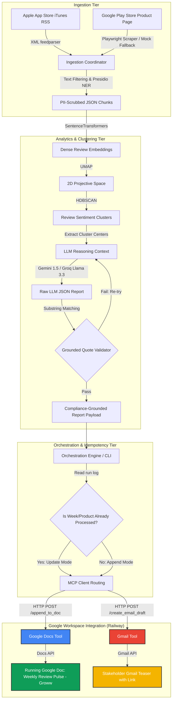

# Impullse: Weekly Product Review Pulse

[](https://www.python.org/)
[](https://aistudio.google.com/)
[](https://workspace.google.com/)
[](https://modelcontextprotocol.io/)

**Impullse** is an automated, production-grade weekly customer sentiment "pulse" system that scrapes, processes, clusters, and aggregates mobile reviews from the Apple App Store and Google Play Store for consumer fintech applications (specifically **Groww**). 

It converts unstructured feedback into actionable product insights, validates them to eliminate AI hallucinations, and delivers clean, formatted weekly summary reports to Google Workspace (Google Docs and Gmail) using a custom Model Context Protocol (MCP) server.

---

## 🚀 System Architecture & Flow

The application is structured into four distinct modular tiers, separating ingestion, analytics, orchestration, and delivery:



---

## ✨ Key Features

### 1. Ingestion Layer
* **Apple App Store RSS:** Parsed using `feedparser` targeting regional customer reviews feeds.
* **Google Play Store Scraper:** Driven via `Playwright` to navigate review DOM cards. Includes an offline high-fidelity mock fallback to guarantee testing success when network resources are throttled.
* **Pre-filters:** Reviews are pre-filtered to exclude short messages (< 8 words), emojis, and non-English scripts (e.g. Devanagari).

### 2. PII Scrubbing Safety Gate
* Integrated with Microsoft Presidio Analyzer & Anonymizer.
* Fallback to regex-based compliance checks to scrub and replace emails (`[EMAIL]`), phone numbers (`[PHONE]`), and multi-digit values (`[ID]`) to prevent leakages to public LLMs.

### 3. Density-Based Clustering
* Compresses texts using `SentenceTransformers` (`BAAI/bge-small-en-v1.5`).
* Applies `UMAP` for dimensional compression and `HDBSCAN` to classify reviews into topic nodes, discarding uninformative comments (outliers) as noise.
* Includes fallbacks using `TF-IDF` and `K-Means` (via `scikit-learn`) for systems lacking native C++ compilation tools.

### 4. Grounded Quote Validator (GQV)
* Checks all quotes returned by the LLM.
* Rejects outputs containing paraphrased quotes or hallucinations and triggers a corrected LLM retry (up to 3 attempts).
* Applies a safety compliance override replacing remaining unverified quotes with closest matched raw review substrings.

### 5. Google Workspace MCP Server
* Decouples Workspace integration from the core agent using custom Gmail & Google Docs MCP servers deployed on Railway.
* Automatically parses Markdown headings, bullet points, and bold text into Google Docs API formatting styles.
* Incorporates human-in-the-loop interactive terminal approvals (`y/n`) for server-side actions.

### 6. Idempotency & Auditing
* **Delivery Logs (`logs/delivery_history.json`):** Tracks teaser emails to prevent double-emailing.
* **Run Logs (`logs/runs/`):** Detailed audit logs tracking timestamp, counts, outliers, and API payloads for strict compliance auditing.

---

## 📁 Repository Structure

```text
c:\Projects\Impullse\
├── Docs/
│   ├── problemstatement.md      # Business drivers & objectives
│   ├── architecture.md          # In-depth system architecture
│   ├── implementation.md        # Detailed phase implementation timeline
│   ├── deployment-plan.md       # Google MCP Server deployment plan
│   ├── README.md                # Project documentation and guide (this file)
│   └── reviews.json             # Local database of normalized & scrubbed reviews
├── logs/
│   ├── delivery_history.json    # Email idempotency log
│   └── runs/                    # Auditable run logs per week
├── mcp_servers/                 # Client schemas / stubs for Node.js MCP integration
│   ├── docs_mcp/
│   └── gmail_mcp/
├── src/
│   ├── cli.py                   # Main CLI entrypoint
│   ├── client.py                # Python MCP Client
│   ├── ingestion/               # RSS and Playwright parsers
│   │   ├── app_store.py
│   │   ├── play_store.py
│   │   ├── scrub.py
│   │   ├── filter.py
│   │   └── normalize.py
│   └── analytics/               # Embeddings & Validation Layer
│       ├── cluster.py
│       ├── summarize.py
│       └── validate.py
├── tests/
│   └── test_system.py           # Unit and Integration test suite
├── .env                         # User configurations (Git ignored)
├── .env.template                # Configuration template
└── requirements.txt             # Main dependencies
```

---

## 🛠️ Installation & Setup

### 1. Prerequisites
Ensure you have **Python 3.10+** installed. Clone the repository and navigate to the project root:

```bash
cd c:\Projects\Impullse
```

### 2. Install Dependencies
Install the required packages:

```bash
pip install -r requirements.txt
```

Initialize playwright browsers:

```bash
playwright install chromium
```

### 3. Environment Configuration
Copy `.env.template` to `.env` and fill in the details:

```bash
cp .env.template .env
```

Define the variables:
* `GEMINI_API_KEY`: API key from Google AI Studio.
* `GROQ_API_KEY`: API key from Groq Console.
* `GOOGLE_DOC_ID`: The unique ID of the running Google Doc (from URL).
* `GOOGLE_MCP_SERVER_URL`: Base URL of the deployed Railway MCP server (`https://my-mcp-server-production-1f3f.up.railway.app`).
* `STAKEHOLDER_EMAILS`: Comma-separated list of recipient emails.

---

## 💻 CLI Usage

The system uses a `Click`-based Python CLI to coordinate execution.

### Run CLI Commands

To trigger a standard dry-run (does not push to Google Docs/Gmail; outputs markdown report in terminal):
```bash
python src/cli.py run --product groww --window-weeks 8 --dry-run
```

To run and deliver the weekly report to Google Workspace:
```bash
python src/cli.py run --product groww --window-weeks 12
```

### Options Guide

| Option | Default | Description |
| :--- | :--- | :--- |
| `--product` | `groww` | Name of the fintech app (e.g. `groww`). |
| `--window-weeks` | `12` | Rolling historical window boundary. |
| `--dry-run` | `False` | Run aggregation and GQV validation without executing Workspace delivery. |
| `--recipients` | *(From env)* | Override email recipients (comma-separated). |

---

## ⚙️ Google Workspace MCP Server Setup

The Google Docs and Gmail MCP Server has been separated from this repository and is hosted in its own dedicated repository. If you wish to run that server locally:

1. Obtain a `credentials.json` file (OAuth 2.0 Client Credentials) from Google Cloud Console with the following scopes:
   - `https://www.googleapis.com/auth/documents`
   - `https://www.googleapis.com/auth/gmail.compose`
2. Place the `credentials.json` in the root of the separated Google MCP server project directory.
3. Start the server from that project directory:
   ```bash
   python server.py
   ```
4. The server will launch on `http://127.0.0.1:8000`. On the first request, it will prompt you in the browser to log in and authorize the scopes, saving credentials locally in `token.json` for subsequent runs.
5. All actions (appending documents, creating emails) require interactive terminal approval (`y/n`) in the server logs.

---

## 🧪 Testing Suite

We use `pytest` for unit and integration testing. Run tests using:

```bash
pytest tests/test_system.py -v
```

This verifies:
* PII scrubbing logic.
* Scraper parser formatting & dates.
* K-Means fallbacks and vector reductions.
* GQV quote matching accuracy.
* Token tracker budget validations.
