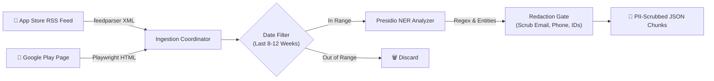
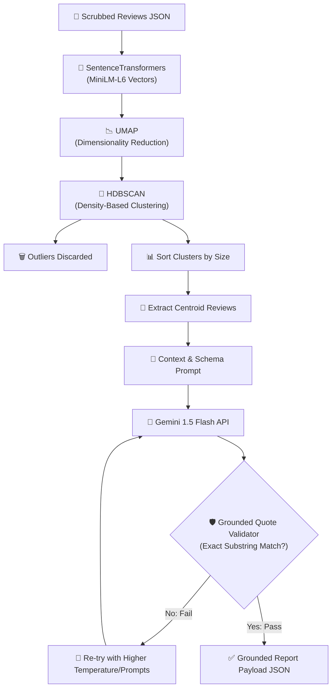
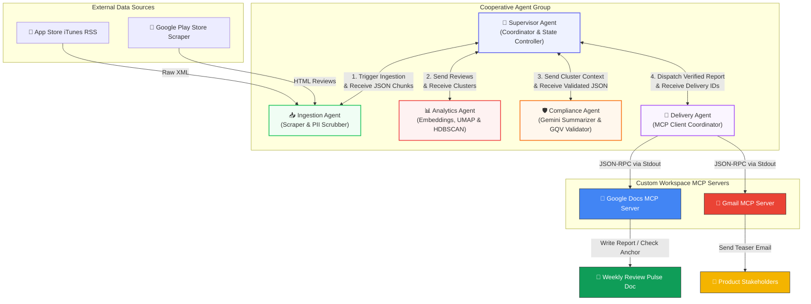
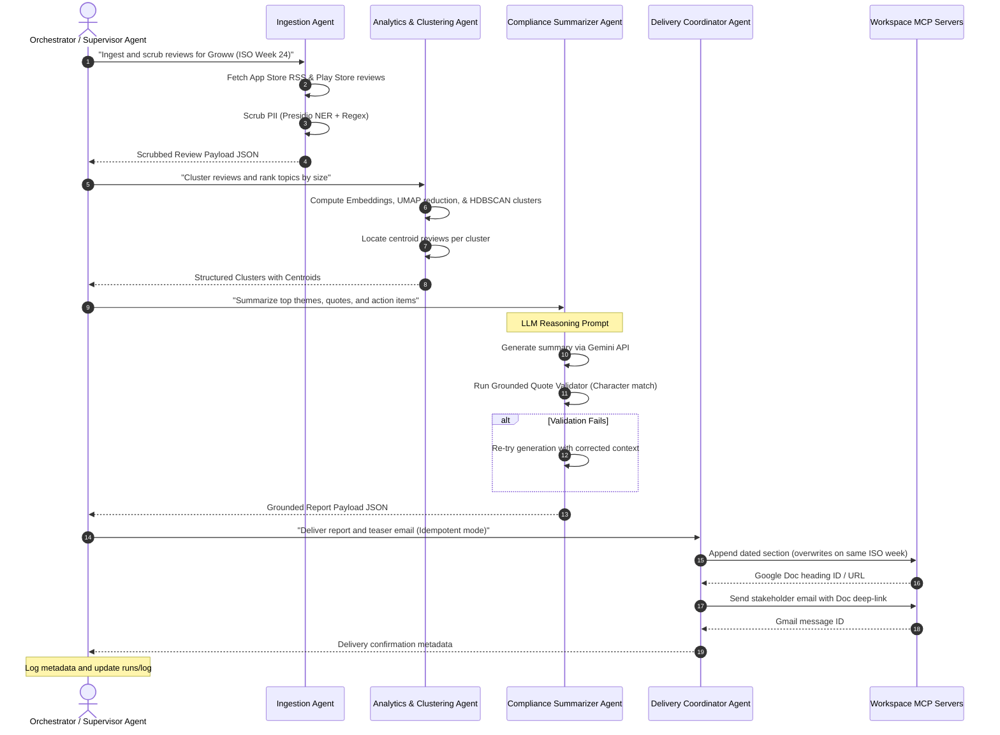

# System Architecture: Impullse (Weekly Product Review Pulse)

This document details the production-grade system architecture and data flows for **Impullse (Weekly Product Review Pulse)**. The system is designed to crawl App Store and Google Play Store reviews for **Groww**, cluster sentiment trends, summarize findings under strict quote validation guidelines, and publish weekly reports using custom-built Model Context Protocol (MCP) servers for Google Docs and Gmail.


---

## 1. High-Level System Architecture Topology

The application is structured into four modular tiers, separating ingestion, analytics, coordination, and delivery.

```mermaid
flowchart TD
    subgraph Ingestion Layer
        A1[Apple App Store iTunes RSS] -->|XML feedparser| Ingestion[Ingestion Coordinator]
        A2[Google Play Store Product Page] -->|Playwright Scraper| Ingestion
        Ingestion -->|Text Cleaning & Presidio NER| Prep[PII Scrubbed JSON Chunks]
    end

    subgraph Analytics & Summarization Layer
        Prep -->|SentenceTransformers| Vectors[Dense Review Embeddings]
        Vectors -->|UMAP| Dim[2D Projective Space]
        Dim -->|HDBSCAN| Clusters[Review Sentiment Clusters]
        Clusters -->|Extract Cluster Centers| Summary[LLM Reasoning Context]
        Summary -->|Gemini 1.5 Flash API| RawReport[Raw LLM JSON Report]
        RawReport -->|Sub-string Matching| Validator{Grounded Quote Validator}
        Validator -- Fail: Re-try --> Summary
        Validator -- Pass --> FinalReport[Compliance-Grounded Report Payload]
    end

    subgraph Orchestration & Idempotency Tier
        FinalReport --> Orchestrator[Orchestration Engine / CLI]
        Orchestrator -->|Read run log| Idempotency{Is Week/Product Already Processed?}
        Idempotency -- Yes: Update Mode --> Delivery[MCP Client Routing]
        Idempotency -- No: Append Mode --> Delivery
    end

    subgraph Deployed Python MCP Server (Railway)
        Delivery -->|HTTP POST /append_to_doc| DocsTool[Google Docs Tool]
        Delivery -->|HTTP POST /create_email_draft| GmailTool[Gmail Tool]
        DocsTool -->|Docs API| Doc[Running Google Doc: Weekly Review Pulse - Groww]
        GmailTool -->|Gmail API| Email[Stakeholder Gmail Teaser with Link]
    end

    style DocsTool fill:#4285F4,stroke:#333,stroke-width:2px,color:#fff
    style GmailTool fill:#EA4335,stroke:#333,stroke-width:2px,color:#fff
    style Doc fill:#0F9D58,stroke:#333,stroke-width:2px,color:#fff
    style Email fill:#F4B400,stroke:#333,stroke-width:2px,color:#fff

```

---

## 2. Data Ingestion Pipeline & PII Scrubbing

Reviews are collected on a weekly cadence for **Groww** across both major mobile application markets.

### 2.1. Ingestion Pipeline Block Diagram



### 2.2. Ingestion Flow Details
1. **Apple App Store Ingestion:** Resolves reviews via the XML RSS feed:
   `https://itunes.apple.com/in/rss/customerreviews/id=1313131313/sortBy=mostRecent/xml` (illustrative App ID).
   The system parses this feed using Python's `feedparser` to extract rating scores, user names, title content, and body paragraphs.
2. **Google Play Ingestion:** Drives a dynamic headless crawl using `Playwright` to extract reviews from the Groww Play Store listing, parsing DOM nodes to handle dynamic content loads and reviews scrolling.
3. **Rolling Window Constraint:** Reviews are filtered to include only those submitted within the configurable rolling window (default: last **8–12 weeks**).
4. **PII Redaction (Safety Gate):** Review texts are passed through Microsoft Presidio Analyzer and Regex rules to scrub personal identifiers:
   - Emails: Replaced with `[EMAIL]`
   - Phone Numbers: Replaced with `[PHONE]`
   - Numbers > 4 digits (potential account/customer IDs): Replaced with `[ID]`

---

## 3. Analytics & Summarization Engine

Raw, scrubbed reviews are clustered to filter out noise (e.g., *"nice"*, *"bad"*) and aggregate volume around major user issues.

### 3.1. Analytics & Validation Pipeline Block Diagram



### 3.2. Semantic Clustering Process
1. **Embedding Generation:** Texts are converted into dense vector space using `SentenceTransformers` (e.g., `all-MiniLM-L6-v2` or Google `text-embedding-004`).
2. **Dimensionality Reduction (UMAP):** Reduces vector dimensions to simplify density-based calculations, preserving local neighborhoods.
3. **Density-Based Clustering (HDBSCAN):** Groups reviews into clusters based on topic density. Reviews classified as noise (outliers) are discarded, removing generic uninformative comments.
4. **Ranking & Centroids:** Topic clusters are ranked by size (number of reviews). Representative reviews close to the centroid of each cluster are selected for the LLM prompt context.

### 3.3. LLM Prompt & Grounded Quote Validation
A structured JSON schema prompt is passed to the `Gemini 1.5 Flash` API:

```python
# Illustrative Summarization prompt
PROMPT_TEMPLATE = """
Analyze the following clustered user reviews for Groww:
{scraped_reviews_data}

Identify the top 3-5 major themes. For each theme:
1. Provide a name and a concise summary.
2. Extract 2-3 representative user quotes that showcase the user sentiment.
3. Propose 1-2 actionable product/support ideas.

You MUST only return a JSON object conforming to this schema:
{{
  "themes": [
    {{
      "theme_name": "string",
      "summary": "string",
      "quotes": ["string"],
      "action_ideas": ["string"]
    }}
  ]
}}

CRITICAL REQUIREMENT: Every quote must be character-for-character identical to a substring present in the provided reviews. Do not modify spelling or punctuation.
"""
```

#### Grounded Quote Validator (GQV)
After receiving the JSON response, the system runs the GQV module:
- Iterate through each `quote` inside the JSON object.
- Search for the exact string inside the raw ingested reviews list.
- If any quote fails the exact character-for-character check, the system rejects the summary and retries the LLM call with increased temperature or corrected prompt rules.

---

## 4. Google Workspace MCP Delivery Tier

Rather than embedding client libraries and OAuth secrets in the core logic, or spawning local subprocesses, **Impullse** delegates all external actions to an external, hosted Python MCP-style web server deployed on Railway (`https://my-mcp-server-production-1f3f.up.railway.app/`). The orchestration client communicates with this server via standard HTTP POST requests. 

This decouples the workspace delivery mechanisms from the ingestion and analytics codebase, allowing the creation of an autonomous AI agent to operate this MCP server in a separate, dedicated project.

### 4.1. Delivery & Idempotency Pipeline Block Diagram

```mermaid
flowchart TD
    SA["👤 Orchestrator Client"] -->|HTTP POST /append_to_doc| DocsTool["📁 Deployed Google Docs Tool"]
    SA -->|HTTP POST /create_email_draft| GmailTool["📧 Deployed Gmail Tool"]

    subgraph Docs API Integration (Python MCP Server)
        DocsTool --> CheckDoc{"Doc Exists?"}
        CheckDoc -->|No| CreateDoc["Create 'Weekly Review Pulse'"]
        CheckDoc -->|Yes| ReadDoc["Read Doc Structure & End Index"]
        CreateDoc & ReadDoc --> Append["Append formatted section<br/>(Markdown-to-Docs Style Parser)"]
    end

    subgraph Gmail API Integration (Python MCP Server)
        GmailTool --> SendEmail["✉️ Create Draft Email with<br/>Google Doc Link"]
    end
```

### 4.2. Deployed Google Docs Tool
The hosted server handles Google Doc operations via the Docs REST API. It provides a REST endpoint:

#### Endpoint: `POST /append_to_doc`
* **Payload:**
  - `doc_id`: String (The target Google Document ID)
  - `content`: String (The report in Markdown style to append)
* **Markdown Styling Parser:**
  - The server automatically parses headers (`###`), lists (`*`/`-`), and bold text (`**`) into native Google Doc styles (`HEADING_3`, `HEADING_4`, `bold: true`) using batch formatting updates.

### 4.3. Deployed Gmail Tool
The hosted server manages draft dispatches via the Gmail REST API.

#### Endpoint: `POST /create_email_draft`
* **Payload:**
  - `to`: String (Recipient email address)
  - `subject`: String (Subject of the email)
  - `body`: String (Plain text body of the email)


---

## 5. Repository & Directory Structure

The project files are organized to support separation of concerns:

```
c:\Projects\Impullse\
├── Docs/
│   ├── problemstatement.md      # Project definition & goals
│   ├── architecture.md          # System design (this file)
│   ├── implementation.md        # Detailed phase implementation timeline
│   ├── edge-case.md             # Edge case handling documentation
│   ├── deployment-plan.md       # Google MCP Server deployment plan
│   ├── README.md                # Project documentation and guide
│   ├── reviews.json             # Local database of normalized & scrubbed reviews
│   └── search.py                # Local review search utility script
├── logs/
│   ├── delivery_history.json    # Idempotency log for Gmail/Docs runs
│   └── runs/                    # Auditable execution history log files
├── mcp_servers/
│   ├── docs_mcp/                # Google Docs MCP server source code (Mock)
│   │   ├── package.json
│   │   └── index.js
│   └── gmail_mcp/               # Gmail MCP server source code (Mock)
│       ├── package.json
│       └── index.js
├── src/
│   ├── __init__.py
│   ├── cli.py                   # Main CLI entrypoint (click-based run coordinator)
│   ├── ingestion/
│   │   ├── __init__.py
│   │   ├── app_store.py         # Apple App Store parser
│   │   ├── play_store.py        # Play Store scraper
│   │   └── scrub.py             # PII presidio scrubber
│   ├── analytics/
│   │   ├── __init__.py
│   │   ├── cluster.py           # Embeddings + UMAP + HDBSCAN
│   │   ├── summarize.py         # Gemini API Integration
│   │   └── validate.py          # Grounded Quote Validator
│   └── client.py                # MCP Client to spawn & orchestrate MCP servers
├── requirements.txt             # Core python dependencies
└── .env.template                # Shell template for API keys & Doc IDs
```

---

## 6. Auditability & Compliance

Every run of the Impullse system writes an entry to `logs/runs/run_log_ISO_WEEK.json` containing:
1. **Execution Metadata:** Run timestamp, configured rolling window duration, processed ISO week.
2. **Review Metrics:** Count of ingested reviews, count of reviews discarded as noise, count of clusters formed.
3. **Workspace Identifiers:** Google Doc ID, appended section header ID, and Gmail message identifier (`message_id`).
This provides a comprehensive audit trail to track what information was sent, to whom, and when.

---

## 7. End-to-End Runflow & Multi-Agent Architecture

To ensure separation of concerns and robust error handling, the system can be modeled as a cooperative team of five specialized, message-passing agents. The following topology diagram, sequence flow, and role matrices map this execution runflow.

### 7.1. Multi-Agent Communication & Topology



### 7.2. Agent Collaboration & Message Sequence



### 7.3. Agent Role Matrix

| Agent Name | Primary Responsibility | Input Payload | Output Payload | Associated Tools |
| :--- | :--- | :--- | :--- | :--- |
| **Supervisor Agent** | Manages execution state, schedules runs, enforces idempotency checks, and handles cross-agent routing. | User CLI arguments or cron schedule triggers. | Final run status and JSON audit log. | `logs/delivery_history.json` and CLI run log writers. |
| **Ingestion Agent** | Scrapes App Store and Play Store reviews, scrubs PII, and normalizes schema structures. | Product identifier and rolling window duration (weeks). | Scrubbed and cleaned review JSON text chunks. | Playwright, `feedparser`, and Presidio NER scrubbers. |
| **Analytics Agent** | Group reviews into semantic topics using embedding models and density clustering. | Raw review text payloads. | Topic clusters mapped to centroids and outlier metadata. | SentenceTransformers, UMAP, and HDBSCAN libraries. |
| **Compliance Agent** | Synthesizes insights, names themes, proposes actions, and verifies LLM quote grounding. | Cluster centroids and raw source text. | Fully validated JSON report containing themes, quotes, and actions. | Gemini 1.5 API and Grounded Quote Validator. |
| **Delivery Agent** | Spawn MCP servers, translate markdown formats, and coordinates idempotent Workspace updates. | Verified report payload, recipient list, and Doc ID. | Deliverable links (Doc header URL and Gmail message ID). | Google Docs MCP Server, Gmail MCP Server, and JSON-RPC client. |

