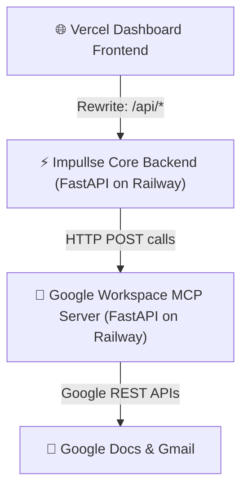

# Combined Deployment Plan: Google MCP Server & Impullse Platform

This document details the step-by-step instructions for redeploying the **separated Google Workspace MCP Server** on Railway, and then deploying the **Impullse Client Platform** (FastAPI backend on Railway and static frontend dashboard on Vercel).

---



---

## 🛠️ PART 1: Redeploying the Separated Google MCP Server on Railway

This server must be redeployed first to obtain the URL that the Impullse platform will connect to.

### 🔒 1. Secrets Management (Railway env vars)
Configure these variables in your **Google MCP Server** service on Railway:

| Key | Value | Description |
| :--- | :--- | :--- |
| `GOOGLE_CREDENTIALS_JSON` | `<content of credentials.json>` | The raw JSON contents of your OAuth Client ID file. |
| `GOOGLE_TOKEN_JSON` | `<content of token.json>` | The authorized user credentials containing access and refresh tokens. |
| `DISABLE_APPROVAL_CHECK` | `true` | **Crucial:** Prevents the server from pausing requests for terminal inputs (`Approve? (y/n)`) in a headless environment. |

### 🚀 2. Preparation & Build Steps
1. Navigate to your separated Google MCP server local directory.
2. Ensure you have run the local token generator (`python get_token.py`) to authorize the scopes and generate `token.json` locally first.
3. Commit and push the code changes to your separated GitHub repository. Ensure `credentials.json` and `token.json` are listed in `.gitignore` so they are not committed publicly.
4. On Railway, create a new service and connect it to your separated Google MCP server GitHub repository.
5. In **Settings** -> **Deploy**, set the **Start Command** to:
   ```bash
   uvicorn server:app --host 0.0.0.0 --port $PORT
   ```
6. Copy the public URL generated by Railway (e.g. `https://my-mcp-server-production-1f3f.up.railway.app`). This will be used as the `GOOGLE_MCP_SERVER_URL` in the Impullse platform.

---

## ⚡ PART 2: Deploying the Impullse Core Backend on Railway

Deploy the backend API that wraps the Click CLI sentiment analysis pipeline.

### 🔒 1. Secrets Management (Railway env vars)
Configure these variables in your **Impullse Backend** service on Railway:

| Key | Value | Description |
| :--- | :--- | :--- |
| `GEMINI_API_KEY` | `AIzaSy...` | Your Google Gemini API Key from Google AI Studio. |
| `GROQ_API_KEY` | `gsk_...` | (Optional) Groq API Key. If provided, the system defaults to Llama 3.3. |
| `GOOGLE_DOC_ID` | `1a2b3c...` | The ID of your running Google Doc report. |
| `GOOGLE_MCP_SERVER_URL` | `https://your-mcp-server.up.railway.app` | The base URL of your deployed MCP server (from **Part 1**). |
| `STAKEHOLDER_EMAILS` | `emails@company.com` | Comma-separated list of default email recipients. |

### 🚀 2. Build Steps
1. Push your updated Impullse repository to GitHub.
2. In Railway, create a new project/service pointing to this repository.
3. The build runner will automatically detect the `Procfile` in the root of the repository to configure the start command. If you wish to configure it manually in the Railway dashboard, set the **Start Command** under **Settings** -> **Deploy** to:
   ```bash
   uvicorn src.server:app --host 0.0.0.0 --port $PORT
   ```
4. Once deployed, copy the generated public URL (e.g., `https://imppulse-production.up.railway.app`).

---

## 🌐 PART 3: Deploying the Impullse Dashboard on Vercel

Host the responsive static dashboard on Vercel and configure transparent proxying.

### 🚀 1. Update Vercel Rewrite Configuration
1. Open the local file [vercel.json](file:///c:/Projects/Impullse/vercel.json) in this repository.
2. Update the `destination` URL to point to your new **Impullse Core Backend URL** from **Part 2**:
   ```json
   {
     "cleanUrls": true,
     "rewrites": [
       {
         "source": "/api/:path*",
         "destination": "https://imppulse-production.up.railway.app/api/:path*"
       }
     ]
   }
   ```
3. Commit and push this update to GitHub.

### 📦 2. Deploy on Vercel
1. Log in to [Vercel](https://vercel.com) and import the Impullse repository.
2. Under **Project Settings**:
   - Set **Build Command** to: `none` or leave it empty.
   - Set **Output Directory** to: `frontend` (tells Vercel to serve files from the `frontend/` folder).
3. Deploy the project.

---

## 🧪 PART 4: Verification

Once all three modules are live:
1. Open the Vercel dashboard URL.
2. Verify that the **CORS/API Status** badge displays **Online**, confirming it successfully connected to the Railway backend via rewrites.
3. Click **Run Analysis Pipeline** on the dashboard.
4. Verify that the background drawer spins, reviews are successfully processed, the Grounded Quote Validator checks out, and the output is appended to the Google Doc and Gmail draft.
