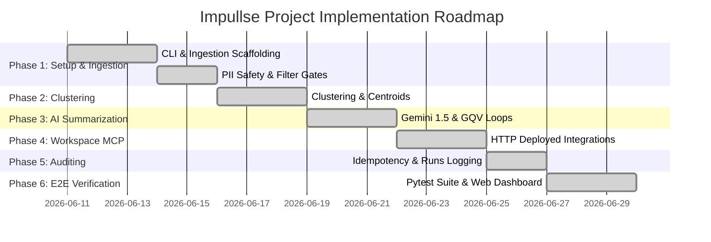

# Implementation Plan: Impullse (Weekly Product Review Pulse)

This document outlines the detailed implementation roadmap and actual progress status for **Impullse (Weekly Product Review Pulse)**. The system automates ingestion, semantic analysis, grounding validation, and Google Workspace delivery of mobile app reviews for the **Groww** application.

---

## 1. Project Directory & Component Overview

The codebase is organized into modular layers separating ingestion, NLP/ML analytics, Workspace delivery, test suites, and the web dashboard interface:

```
c:\Projects\Impullse\
├── Docs/
│   ├── problemstatement.md      # Business context & project vision
│   ├── architecture.md          # System design & block diagrams
│   ├── implementation.md        # Phase-wise roadmap & status (this file)
│   ├── deployment-plan.md       # Deployed platform settings & variables
│   ├── edge-case.md             # Edge case & fallback definitions
│   └── reviews.json             # Local database of normalized & PII-scrubbed reviews
├── frontend/
│   ├── index.html               # Responsive HTML5 web dashboard
│   ├── styles.css               # Modern dark-mode vanilla CSS UI
│   └── app.js                   # Dashboard logic & API status manager
├── logs/
│   ├── delivery_history.json    # Idempotency cache log for stakeholder dispatches
│   ├── token_usage.json         # Budget log for Groq / Gemini API tokens
│   └── runs/                    # Auditable execution history logs
├── mcp_servers/
│   ├── docs_mcp/                # Node.js Google Docs stdio MCP server (Mock)
│   │   ├── package.json
│   │   └── index.js             # Handshake & dated pulse report tool
│   └── gmail_mcp/               # Node.js Gmail stdio MCP server (Mock)
│       ├── package.json
│       └── index.js             # Handshake & email teaser notification tool
├── src/
│   ├── __init__.py
│   ├── cli.py                   # Click CLI entrypoint coordinator
│   ├── client.py                # Python Stdio MCP client wrapper
│   ├── server.py                # FastAPI backend server
│   ├── run_phase_2.py           # Phase 2 clustering runner script
│   ├── run_phase_3.py           # Phase 3 summarization runner script
│   ├── run_phase_4.py           # Phase 4 delivery runner script
│   ├── ingestion/
│   │   ├── __init__.py
│   │   ├── app_store.py         # Apple App Store RSS fetcher
│   │   ├── play_store.py        # Play Store Playwright scraper & mock fallback
│   │   ├── scrub.py             # PII Presidio and Regex scrubber
│   │   ├── filter.py            # Word length, emoji & non-English filter
│   │   └── normalize.py         # HTML unescaping and schema normalizer
│   └── analytics/
│       ├── __init__.py
│       ├── cluster.py           # Embeddings + UMAP + HDBSCAN + KMeans fallbacks
│       ├── summarize.py         # Gemini 1.5 & Groq Llama client & TokenTracker
│       └── validate.py          # Grounded Quote Validator (GQV) & self-correction
├── tests/
│   └── test_system.py           # Pytest unit and integration test suite
├── .env.template                # Env variables template
└── requirements.txt             # Project library requirements
```

---

## 2. Implementation Progress & Timeline



---

## 3. Phase Implementation Details

### Phase 1: Setup, CLI Scaffolding & Core Ingestion [COMPLETED]
Build the project environment, CLI coordinator structure, scraping modules for mobile platforms, and the PII scrubbing safety gate.
* **Task 1.1: Environment Configuration (`requirements.txt`) [DONE]**
  * Configured core dependencies: `click`, `feedparser`, `playwright`, `presidio-analyzer`, `sentence-transformers`, `umap-learn`, `hdbscan`, `google-genai`, `fastapi`, `uvicorn`, `pytest`.
* **Task 1.2: Apple App Store Ingestion (`src/ingestion/app_store.py`) [DONE]**
  * Targets Apple RSS customer reviews XML feed for product `id=1402085352` (Groww).
  * Parses and extracts reviews matching the `window_weeks` duration.
* **Task 1.3: Google Play Store Ingestion (`src/ingestion/play_store.py`) [DONE]**
  * Dynamic headless scraping using `Playwright` with robust scrolling.
  * Implemented fallback mock generator to support offline testing and handle page blocking.
* **Task 1.4: PII Scrubbing Safety Gate (`src/ingestion/scrub.py`) [DONE]**
  * Redacts emails (`[EMAIL]`), phone numbers (`[PHONE]`), and sequences of digits >= 5 (`[ID]`).
* **Task 1.5: Review Filtering Gate (`src/ingestion/filter.py`) [DONE]**
  * Discards spam shorter than 8 words, emojis, and non-English scripts.
* **Task 1.6: Normalization (`src/ingestion/normalize.py`) [DONE]**
  * Decodes HTML entities and normalizes review schemas.

### Phase 2: Semantic Clustering Module [COMPLETED]
Group raw customer reviews into high-density semantic nodes to separate noise from actionable indicators.
* **Task 2.1: Embedding Generation (`src/analytics/cluster.py`) [DONE]**
  * Vectorizes text using `BAAI/bge-small-en-v1.5` sentence-transformer.
* **Task 2.2: UMAP & HDBSCAN Clustering (`src/analytics/cluster.py`) [DONE]**
  * Applies `UMAP` dimension reduction followed by `HDBSCAN` density clustering.
* **Task 2.3: Clustering Fallbacks (`src/analytics/cluster.py`) [DONE]**
  * TF-IDF Vectorizer + KMeans fallback, and rating/length-based sorting logic safeguard to guarantee zero runtime failures.
* **Task 2.4: Centroid Extraction (`src/analytics/cluster.py`) [DONE]**
  * Isolates representative centroid reviews matching the mean vector of each topic cluster.

### Phase 3: AI Summarization & Grounding Validation [COMPLETED]
Translate unstructured clusters into actionable themes under strict verification boundaries.
* **Task 3.1: LLM Summarizer Client (`src/analytics/summarize.py`) [DONE]**
  * Integrated dual-model handler: defaults to Groq (`llama-3.3-70b-versatile`) if `GROQ_API_KEY` is present; falls back to Google GenAI (`gemini-1.5-flash`).
  * Enforces strict daily budget limit of **70,000 tokens per day** via `TokenTracker`.
* **Task 3.2: Grounded Quote Validator - GQV (`src/analytics/validate.py`) [DONE]**
  * Verifies character-for-character matching of generated quotes against raw review texts.
* **Task 3.3: Self-Correcting Retry Loop & Force Grounding (`src/analytics/validate.py`) [DONE]**
  * Executes up to 3 self-correcting retries with warning contexts, falling back to a guaranteed compliance override.

### Phase 4: Google Workspace MCP Integration via Deployed Server [COMPLETED]
Integrate Workspace actions with the decoupled, hosted Google Workspace MCP FastAPI server on Railway (`https://my-mcp-server-production-1f3f.up.railway.app`).
* **Task 4.1: Integrate Deployed Google Docs Tool (`src/cli.py`) [DONE]**
  * Invokes `POST /append_to_doc` to write report updates using native Docs API named styles.
* **Task 4.2: Integrate Deployed Gmail Tool (`src/cli.py`) [DONE]**
  * Invokes `POST /create_email_draft` to draft email notifications linking back to the Google Doc.
* **Task 4.3: Decoupled Agent Project Planning [DONE]**
  * Documented project planning decoupling (MCP server runs in a separate, dedicated repository).
* **Task 4.4: Phase 4 Execution Runner (`src/run_phase_4.py`) [DONE]**
  * Created execution runner script to trigger the full pipeline with Workspace delivery enabled.

### Phase 5: Auditing, Logging & Idempotency [COMPLETED]
Enforce execution locks, logs audit compliance, and delivery safeguards.
* **Task 5.1: Idempotency History Log (`logs/delivery_history.json`) [DONE]**
  * Records email teaser deliveries. Checked before every dispatch to block double email spam.
* **Task 5.2: Audit Logs & Execution Locks (`logs/runs/`) [DONE]**
  * Saves audit files containing metadata, cluster info, validation passes, and delivery status logs.
  * Enforces cross-instance execution locking using a PID-tracked file lock (`logs/impullse.lock`) in `src/cli.py` to prevent concurrent pipeline runs. Verified by unit tests.

### Phase 6: E2E Verification & Integration Testing [COMPLETED]
Verify all components using modular test suites and provide a visual operator dashboard.
* **Task 6.1: Pytest Testing Suite (`tests/test_system.py`) [DONE]**
  * Created 11 test cases spanning PII scrubbing, date parsing, KMeans fallback, GQV validators, force grounding, word filters, normalizations, token budget trackers, delivery idempotency, mocked HTTP Workspace requests, and FastAPI backend routes.
* **Task 6.2: Web Operator Dashboard (`frontend/`) [DONE]**
  * Designed dark-mode UI frontend dashboard interacting with the FastAPI server backend endpoints in `src/server.py`.

---

## 4. Verification & Testing Execution

### 1. Running Unit and Integration Tests
Execute the pytest suite using the python module runner:
```bash
python -m pytest tests/test_system.py
```
Expected output:
```text
tests/test_system.py ...........                                           [100%]
=========================== 11 passed in 1.45s ===========================
```

### 2. Manual Pipeline Run
Run the Phase 4 delivery runner to trigger the live pipeline:
```bash
python src/run_phase_4.py
```
Check `logs/runs/` and your target Google Doc / Gmail account to verify that the pulse updates are successfully appended.